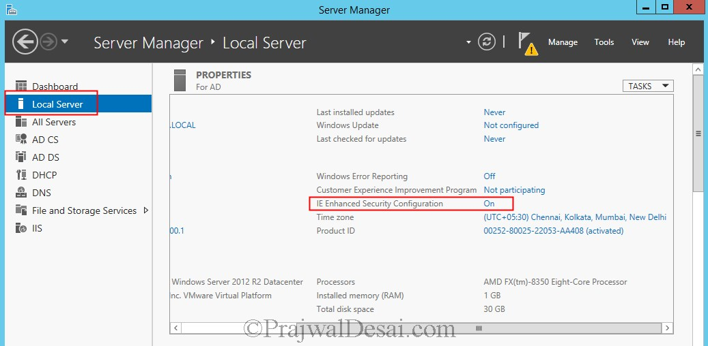

# Set up for Chef Tutorial

## Terraform

1.  Set up aws-cli with your AWS Access Keys
1.  Run Terraform plan
1.  if encrypted - Decrypt private key

    ```
    openssl rsa -in <Encrypted key filename>  -out < desired output file name>
    ```

1.  Get Windows password

    ```
    instance_id=$(terraform output instance_id)
    password=$(aws ec2 get-password-data \
        --instance-id ${instance_id} \
        --priv-launch-key ~/.ssh/id_honestbee-decrypted \
        --query "PasswordData" --output text)

    # echo $password
    ```

    In future, it may be possible to use 
    [`rsadecrypt` TF function](https://github.com/hashicorp/terraform/pull/16647)

1.  Connect using Microsoft Remote Desktop

    ```
    username: Administrator
    password: $password
    ip:       $(terraform output instance_ip)
    ```

Note to get rid of pesky Internet Explorer enhanced security:



## Chef 

Source: https://learn.chef.io/modules/learn-the-basics/windows/aws/set-up-a-machine-to-manage#/

```powershell
. { iwr -useb https://omnitruck.chef.io/install.ps1 } | iex; install -project chefdk -channel stable -version 2.0.28
```

